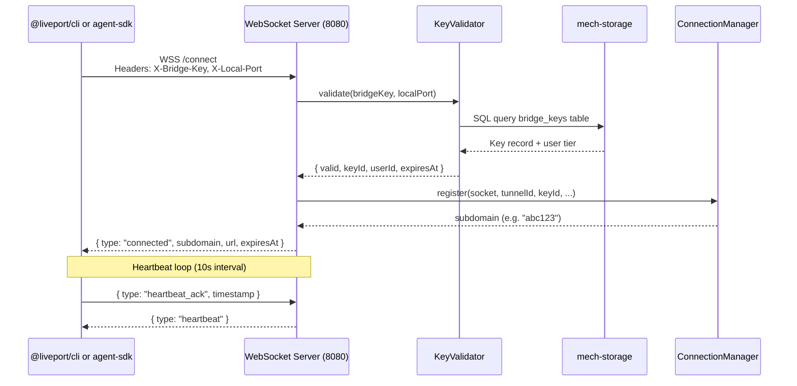
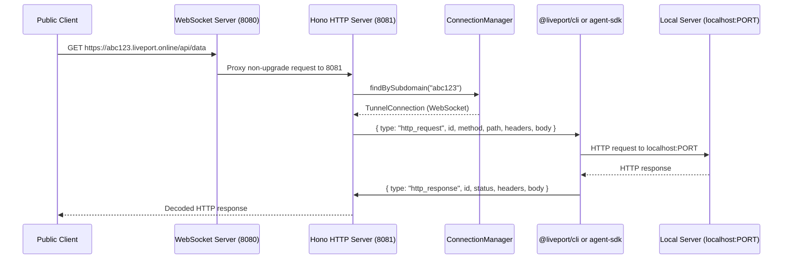
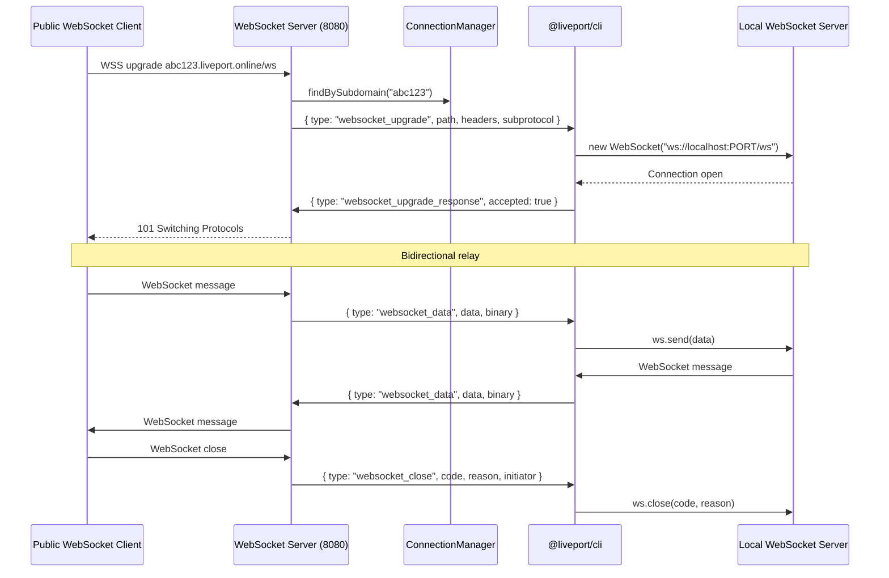
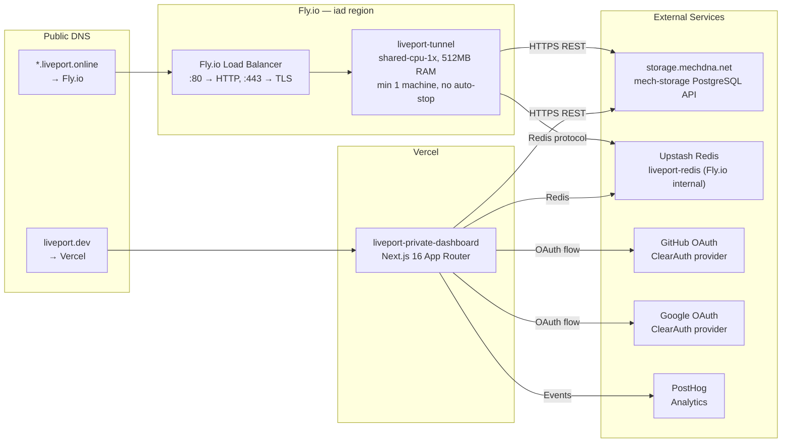

<!-- Generated by docs-generator | 2026-03-14 | Source: docs-generator.json -->

# Architecture: LivePort

> Secure localhost tunnels for AI agents — expose local servers to the internet with bridge key authentication

## System Overview

LivePort is a WebSocket-based reverse proxy that tunnels HTTP and WebSocket traffic from the public internet to local development servers. The system uses a pnpm monorepo with Turborepo, deploying a tunnel server on Fly.io and a Next.js dashboard on Vercel. Authentication is handled via bridge keys and ClearAuth OAuth.

### Monorepo Structure

| Package | Path | Description |
|---------|------|-------------|
| `@liveport/shared` | `packages/shared/` | Core utilities: DB client, Redis, auth, key utils, types |
| `@liveport/cli` | `packages/cli/` | CLI binary `liveport` (Commander.js) |
| `@liveport/agent-sdk` | `packages/agent-sdk/` | Agent SDK for programmatic tunnel access |
| `@liveport/mcp` | `packages/mcp/` | MCP server for AI agent tooling |
| `apps/dashboard` | `apps/dashboard/` | Next.js 16 web dashboard |
| `apps/tunnel-server` | `apps/tunnel-server/` | Tunnel server (Hono + WebSocket) |

Package manager: pnpm 9.14.2 + Turborepo. Node.js >= 20.0.0.

## Component Diagram

```mermaid
graph TB
    subgraph "Client Side"
        CLI["@liveport/cli<br/>Commander.js + WebSocket"]
        SDK["@liveport/agent-sdk<br/>fetch + WebSocket client"]
        MCP["@liveport/mcp<br/>MCP server"]
        LocalServer["Local Dev Server<br/>localhost:PORT"]
    end

    subgraph "Fly.io — iad region"
        subgraph "liveport-tunnel"
            WSServer["WebSocket Server<br/>port 8080"]
            HTTPServer["Hono HTTP Server<br/>port 8081 (internal)"]
            ConnMgr["ConnectionManager<br/>In-memory tunnel registry"]
            KeyValidator["KeyValidator<br/>Bridge key auth"]
            Metering["Metering Service<br/>Usage tracking"]
            ProxyGW["Proxy Gateway<br/>HTTPS CONNECT proxy (optional)"]
        end
    end

    subgraph "Vercel"
        NextApp["Next.js 16 Dashboard<br/>App Router + ClearAuth"]
    end

    subgraph "Mech Infrastructure"
        MechDB[("mech-storage<br/>PostgreSQL REST API<br/>storage.mechdna.net")]
    end

    subgraph "Fly.io Redis"
        Redis[("Upstash Redis<br/>liveport-redis")]
    end

    subgraph "Public Internet"
        PublicClient["Browser / HTTP Client"]
    end

    CLI -->|"WSS /connect<br/>X-Bridge-Key, X-Local-Port"| WSServer
    SDK -->|"WSS /connect"| WSServer
    SDK -->|"HTTPS /api/agent/tunnels"| NextApp
    MCP -->|"uses"| SDK
    WSServer -->|"non-WS upgrade traffic"| HTTPServer
    WSServer --> ConnMgr
    HTTPServer --> ConnMgr
    ConnMgr --> KeyValidator
    KeyValidator -->|"validate bridge key"| MechDB
    Metering -->|"sync usage"| MechDB
    ConnMgr -->|"rate limiting"| Redis
    NextApp -->|"auth + data"| MechDB
    PublicClient -->|"HTTPS *.liveport.online"| WSServer
    CLI -->|"forward HTTP"| LocalServer
    SDK -->|"forward HTTP"| LocalServer
```

## Data Flow

### CLI/SDK Tunnel Connection

### HTTP Request Proxying

### WebSocket Proxying

## Deployment Topology

## Services

### Tunnel Server (`apps/tunnel-server/`)

- **Runtime**: Bun / Node.js (Hono framework + WebSocket)
- **Deployment**: Fly.io (`liveport-tunnel` app, `iad` region)
- **Ports**: 8080 (WebSocket + HTTP proxy inlet), 8081 (Hono HTTP internal)
- **Dependencies**: `@liveport/shared`, mech-storage, Upstash Redis
- **Concurrency**: 1000 connections hard/soft limit
- **Health Check**: `GET /health` every 10s
- **Min machines**: 1; auto-stop: disabled

### Dashboard (`apps/dashboard/`)

- **Runtime**: Next.js 16 (App Router)
- **Deployment**: Vercel (`liveport-private-dashboard`)
- **Port**: 3001 (local dev)
- **Auth**: ClearAuth (GitHub + Google OAuth)
- **Dependencies**: `@liveport/shared`, mech-storage, Redis

### CLI (`packages/cli/`)

- **Runtime**: Node.js 20+
- **Binary**: `liveport` (published as `@liveport/cli`)
- **Protocol**: WSS to tunnel server at `WSS /connect`
- **Reconnect**: Up to 5 attempts, exponential backoff

### Agent SDK (`packages/agent-sdk/`)

- **Runtime**: Node.js 20+ / any JS runtime with `fetch` and `WebSocket`
- **Package**: `@liveport/agent-sdk`
- **Auth**: Bridge key via `Authorization: Bearer` and `X-Bridge-Key` header

### MCP Server (`packages/mcp/`)

- **Package**: `@liveport/mcp`
- **Purpose**: Exposes LivePort tunnel capabilities as MCP tools for AI agents

### Shared Library (`packages/shared/`)

- **Build**: tsup (CJS + ESM + DTS)
- **Exports**: `db/` (MechStorageClient + repos), `redis/` (client, rate limiting, tunnel state), `auth/` (ClearAuth adapter), `keys/` (key gen + validation), `types/`

## Storage

| Store | Technology | Purpose | Access Pattern |
|-------|-----------|---------|----------------|
| Primary DB | mech-storage (PostgreSQL REST API) | Users, bridge keys, tunnels, sessions | REST + raw SQL via `db.query()` |
| Cache / Rate Limiting | Upstash Redis (Fly.io) | Rate limiting, tunnel state | Sliding window; `tunnel:ratelimit:*` prefix |
| Tunnel Registry | In-memory (ConnectionManager) | Active tunnel connections | Map lookup by subdomain / keyId / tunnelId |

### Database Schema

Tables follow ClearAuth conventions plus LivePort-specific tables:

| Table | Description |
|-------|-------------|
| `user` | User accounts (`id`, `email`, `name`, `tier`, timestamps) |
| `session` | Auth sessions |
| `account` | OAuth accounts (GitHub, Google) |
| `verification` | Email verification tokens |
| `bridge_keys` | Bridge keys (`id`, `userId`, `name`, `keyHash`, `keyPrefix`, `status`, `expiresAt`, `maxUses`, `currentUses`, `allowedPort`) |
| `tunnels` | Tunnel records (`id`, `userId`, `bridgeKeyId`, `subdomain`, `localPort`, `publicUrl`, `region`, `requestCount`, `bytesTransferred`) |

**Note:** `mech-storage` `getRecord`/`getRecords` may fail with TABLE_NOT_FOUND for simple table names — use `db.query()` with raw SQL as the workaround (applied in `repositories.ts` and `mech-storage-adapter.ts`).

## External Integrations

| Service | Purpose | Auth Method |
|---------|---------|-------------|
| mech-storage API | Database (PostgreSQL) | `MECH_APPS_APP_ID` + `MECH_APPS_API_KEY` |
| Upstash Redis | Rate limiting, tunnel state caching | `REDIS_URL` connection string |
| GitHub OAuth | User authentication | ClearAuth provider |
| Google OAuth | User authentication | ClearAuth provider |
| PostHog | Analytics | `NEXT_PUBLIC_POSTHOG_KEY` |

## Network & Security

### Authentication Flow

1. **Dashboard**: ClearAuth with GitHub/Google OAuth providers. Sessions stored in mech-storage, validated via cookies. Lazy Proxy pattern used for env vars at build time.
2. **Tunnel Server**: Bridge keys validated against mech-storage. Key format: `lpk_<32 chars>`. Keys are hashed before storage (only prefix stored in plaintext for display).
3. **Agent SDK**: Bearer token auth using bridge keys on all dashboard API requests.

### Bridge Key Format

- **Full key**: `lpk_<32 random chars>` (36 chars total)
- **Display prefix**: first 12 chars (e.g. `lpk_xxxxxxxx`)
- **Hashing**: Only `keyHash` is stored; plaintext never persisted after creation

### Rate Limiting

- Redis-backed sliding window rate limiter
- Key prefix (first 8 chars) used as rate limit identifier
- WebSocket preset configuration
- Graceful degradation when Redis is unavailable

### Connection Limits

- Free tier: 1 concurrent tunnel per key
- Paid tiers: Up to `maxConnectionsPerKey` (default 5) concurrent tunnels
- Max pending WebSocket upgrades: 1000 (DoS protection)

### Request Limits

- Max request body: 10MB
- Max WebSocket frame: 10MB
- Request timeout: 30s
- Heartbeat interval: 10s, timeout: 30s

### TLS

- Fly.io terminates TLS at the load balancer (443 → TLS + HTTP/WS)
- On-demand TLS cert validation via `/api/tls-check` endpoint (approves only `*.liveport.online`)

### Proxy Gateway (Optional)

- HTTPS CONNECT proxy for AI agent outbound API access
- Requires `PROXY_GATEWAY_ENABLED=true`
- Requires explicit `PROXY_ALLOWED_HOSTS` and/or `PROXY_ALLOWED_DOMAINS` allowlist (SSRF protection; refuses to start without allowlist)
- Token-based auth with configurable TTL (30s–3600s, default 600s)
- Minted via `POST /api/proxy/token` (requires `X-Api-Secret`)

## Environment Variables

### Tunnel Server

| Variable | Required | Default | Description |
|----------|----------|---------|-------------|
| `PORT` | No | `8080` | Server port |
| `HOST` | No | `0.0.0.0` | Bind address |
| `BASE_DOMAIN` | No | `liveport.online` | Base domain for tunnel subdomains |
| `MECH_APPS_APP_ID` | Yes | — | mech-storage app ID |
| `MECH_APPS_API_KEY` | Yes | — | mech-storage API key |
| `MECH_APPS_URL` | No | `https://storage.mechdna.net` | mech-storage base URL (no `/api` suffix) |
| `REDIS_URL` | No | — | Redis URL for rate limiting |
| `INTERNAL_API_SECRET` | No | — | Secret for internal API endpoints |
| `PROXY_GATEWAY_ENABLED` | No | `false` | Enable HTTPS CONNECT proxy |
| `PROXY_TOKEN_SECRET` | Cond. | — | Secret for proxy token signing |
| `PROXY_ALLOWED_HOSTS` | Cond. | — | Comma-separated allowed proxy hosts |
| `PROXY_ALLOWED_DOMAINS` | Cond. | — | Comma-separated allowed proxy domain suffixes |
| `PROXY_DEFAULT_PROVIDER` | No | `oxylabs` | Default proxy provider |
| `PROXY_GATEWAY_TIMEOUT_MS` | No | `30000` | Proxy request timeout |
| `METERING_SYNC_INTERVAL_MS` | No | `30000` | Metrics sync interval |
| `METERING_ENABLED` | No | `true` | Enable metering |

### Dashboard

| Variable | Required | Description |
|----------|----------|-------------|
| `MECH_APPS_APP_ID` | Yes | mech-storage app ID |
| `MECH_APPS_API_KEY` | Yes | mech-storage API key |
| `MECH_APPS_URL` | No | mech-storage base URL (no `/api` suffix) |
| `REDIS_URL` | Yes | Redis connection string |
| `CLEARAUTH_SECRET` | Yes | ClearAuth secret (32+ chars) |
| `AUTH_SECRET` | Yes | Auth secret (32+ chars) |
| `NEXT_PUBLIC_POSTHOG_KEY` | No | PostHog analytics key |
| `NEXT_PUBLIC_POSTHOG_HOST` | No | PostHog host |

**Critical:** `MECH_APPS_URL` must not include the `/api` suffix. ClearAuth's `MechSqlClient` adds `/api` internally — passing a URL with `/api` already appended will cause all auth DB queries to hit `/api/api/...` (404).
