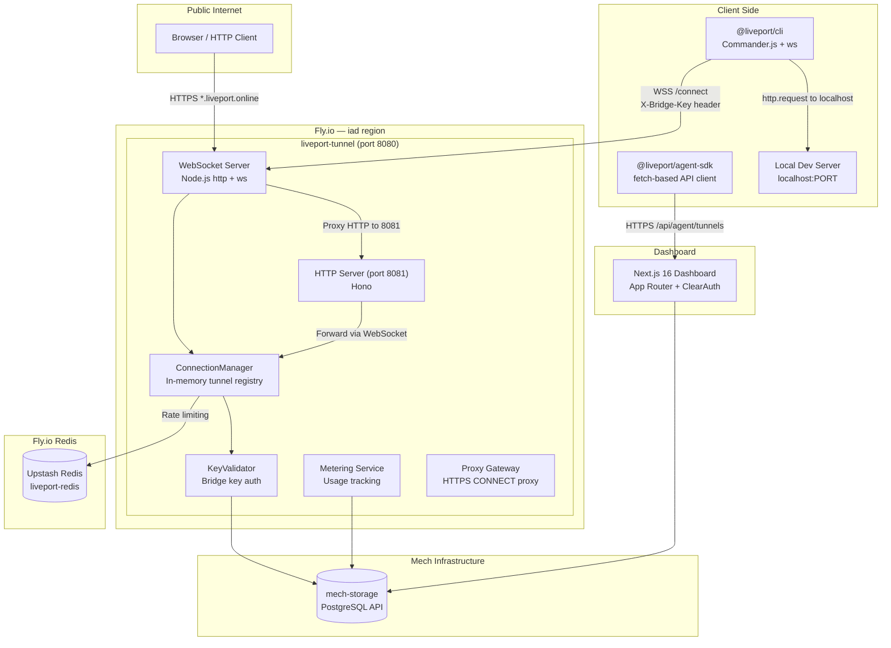
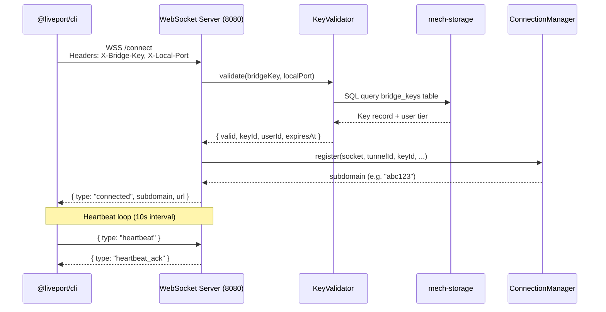
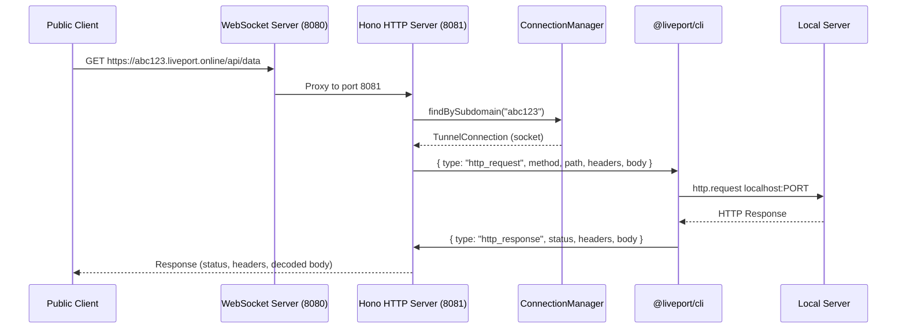
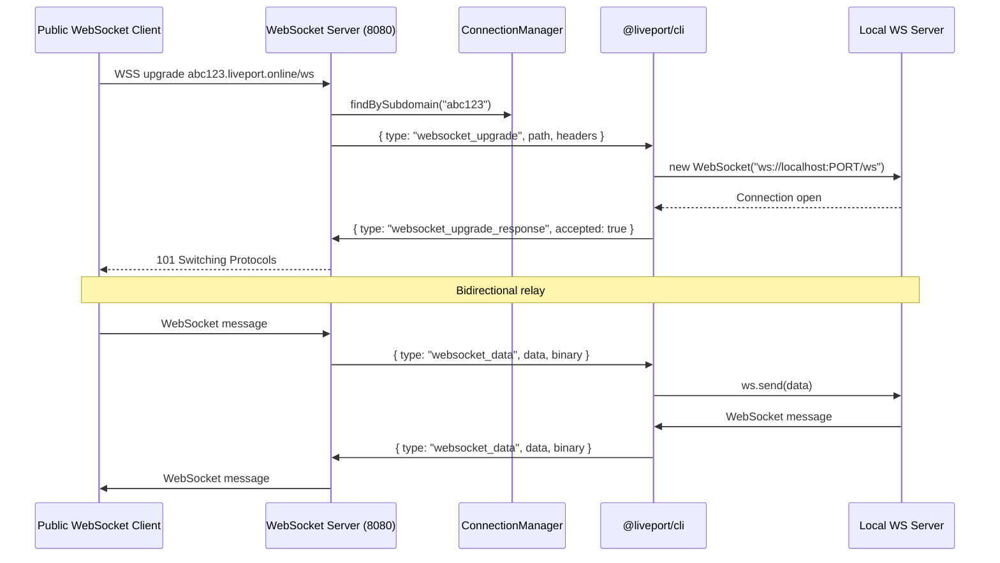
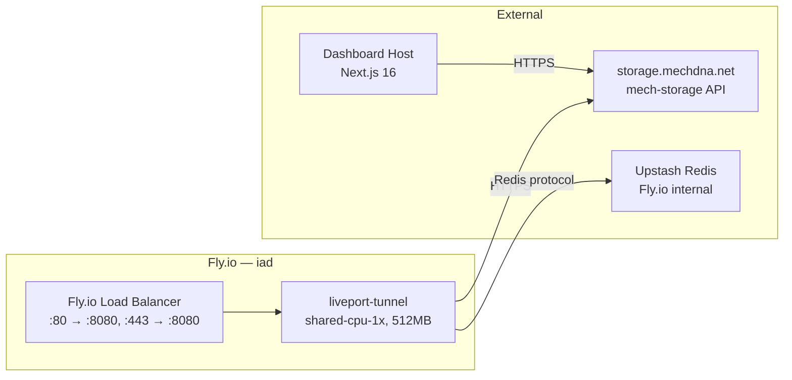

<!-- Generated by docs-generator | 2026-02-17 | Source: docs-generator.json -->

# Architecture: LivePort

> Secure localhost tunnels for AI agents — expose local servers to the internet with bridge key authentication

## System Overview

LivePort is a WebSocket-based reverse proxy that tunnels HTTP and WebSocket traffic from the public internet to local development servers. The system uses a pnpm monorepo with Turborepo, deploying a tunnel server on Fly.io and a Next.js dashboard on a separate host. Authentication is handled via bridge keys and ClearAuth OAuth.

## Component Diagram

## Data Flow

### CLI Tunnel Connection

### HTTP Request Proxying

### WebSocket Proxying

## Deployment Topology

## Services

### Tunnel Server (`apps/tunnel-server/`)

- **Runtime**: Node.js (Hono + ws library)
- **Deployment**: Fly.io (`liveport-tunnel` app, `iad` region)
- **Ports**: 8080 (WebSocket + HTTP proxy), 8081 (Hono HTTP internal)
- **Dependencies**: mech-storage (PostgreSQL API), Upstash Redis
- **Concurrency**: 1000 connections (hard/soft limit)
- **Health Check**: `GET /health` every 10s

### Dashboard (`apps/dashboard/`)

- **Runtime**: Next.js 16 (App Router)
- **Port**: 3001
- **Auth**: ClearAuth (GitHub + Google OAuth)
- **Dependencies**: mech-storage, @liveport/shared

### CLI (`packages/cli/`)

- **Runtime**: Node.js 18+
- **Binary**: `liveport` (via Commander.js)
- **Dependencies**: ws, chalk, ora, commander, http-proxy
- **Protocol**: WSS to tunnel server at `/connect`

### Agent SDK (`packages/agent-sdk/`)

- **Runtime**: Node.js 18+ / any JS runtime with fetch
- **Dependencies**: @liveport/shared
- **Protocol**: HTTPS to dashboard API (`/api/agent/tunnels`)

### Shared Library (`packages/shared/`)

- **Build**: tsup (CJS + ESM + DTS)
- **Exports**: DB client, repositories, Redis client, rate limiting, key utilities, types

## Storage

| Store | Technology | Purpose | Access Pattern |
|-------|-----------|---------|----------------|
| Primary DB | mech-storage (PostgreSQL API) | Users, bridge keys, tunnels, sessions | REST API + raw SQL queries |
| Cache/Rate Limiting | Upstash Redis (Fly.io) | Rate limiting, tunnel state | `tunnel:ratelimit:*` key prefix |
| Tunnel Registry | In-memory (ConnectionManager) | Active tunnel connections | Map lookup by subdomain/keyId/tunnelId |

## External Integrations

| Service | Purpose | Auth Method |
|---------|---------|-------------|
| mech-storage API | Database (PostgreSQL) | `MECH_APPS_APP_ID` + `MECH_APPS_API_KEY` |
| Upstash Redis | Rate limiting, caching | `REDIS_URL` connection string |
| GitHub OAuth | User authentication | ClearAuth provider config |
| Google OAuth | User authentication | ClearAuth provider config |

## Network & Security

### Authentication Flow

1. **Dashboard**: ClearAuth with GitHub/Google OAuth providers. Sessions stored in mech-storage, validated via cookies.
2. **Tunnel Server**: Bridge keys validated against mech-storage. Key format: `lpk_<32 chars>`. Keys are hashed before storage.
3. **Agent SDK**: Bearer token auth using bridge keys against dashboard API.

### Rate Limiting

- Redis-backed sliding window rate limiter
- Key prefix used as rate limit identifier (first 8 chars of bridge key)
- WebSocket preset configuration
- Graceful degradation when Redis is unavailable

### Connection Limits

- Free tier: 1 concurrent tunnel per key
- Paid tiers: Up to `maxConnectionsPerKey` (default 5) concurrent tunnels
- Max WebSocket connections per tunnel: configurable (`MAX_WEBSOCKETS_PER_TUNNEL`)
- Max pending WebSocket upgrades: 1000 (DoS protection)

### Request Limits

- Max request body: 10MB
- Max WebSocket frame: 10MB
- Request timeout: 30s
- Heartbeat interval: 10s, timeout: 30s

### TLS

- Fly.io terminates TLS at the load balancer (ports 80 → HTTP, 443 → TLS + HTTP)
- On-demand TLS certificate validation via `/api/tls-check` endpoint (for Caddy integration)
- Only `*.liveport.online` subdomains are approved for certificates

### Proxy Gateway (Optional)

- HTTPS CONNECT proxy for AI agent API access
- Requires `PROXY_GATEWAY_ENABLED=true` and `PROXY_ALLOWED_HOSTS`/`PROXY_ALLOWED_DOMAINS` allowlist
- Token-based auth with configurable TTL (30s–1hr)
- Refuses to start without explicit allowlist (SSRF protection)

## Environment Variables

### Tunnel Server

| Variable | Required | Description |
|----------|----------|-------------|
| `PORT` | No | Server port (default: 8080) |
| `HOST` | No | Bind address (default: 0.0.0.0) |
| `BASE_DOMAIN` | No | Base domain for tunnels (default: liveport.online) |
| `MECH_APPS_APP_ID` | Yes | mech-storage app ID |
| `MECH_APPS_API_KEY` | Yes | mech-storage API key |
| `MECH_APPS_URL` | No | mech-storage base URL without /api suffix (default: https://storage.mechdna.net) |
| `REDIS_URL` | No | Redis URL for rate limiting |
| `INTERNAL_API_SECRET` | No | Secret for internal API endpoints |
| `PROXY_GATEWAY_ENABLED` | No | Enable HTTPS CONNECT proxy (default: false) |
| `PROXY_TOKEN_SECRET` | No | Secret for proxy token signing |
| `PROXY_ALLOWED_HOSTS` | Cond. | Comma-separated allowed proxy hosts (required if proxy enabled) |
| `PROXY_ALLOWED_DOMAINS` | Cond. | Comma-separated allowed proxy domain suffixes |
| `PROXY_DEFAULT_PROVIDER` | No | Default proxy provider (default: oxylabs) |
| `PROXY_GATEWAY_TIMEOUT_MS` | No | Proxy request timeout (default: 30000) |
| `METERING_SYNC_INTERVAL_MS` | No | Metrics sync interval (default: 30000) |
| `METERING_ENABLED` | No | Enable metering (default: true) |

### Dashboard

| Variable | Required | Description |
|----------|----------|-------------|
| `MECH_APPS_APP_ID` | Yes | mech-storage app ID |
| `MECH_APPS_API_KEY` | Yes | mech-storage API key |
| `REDIS_URL` | Yes | Redis connection string |
| `CLEARAUTH_SECRET` | Yes | ClearAuth secret (32+ chars) |
