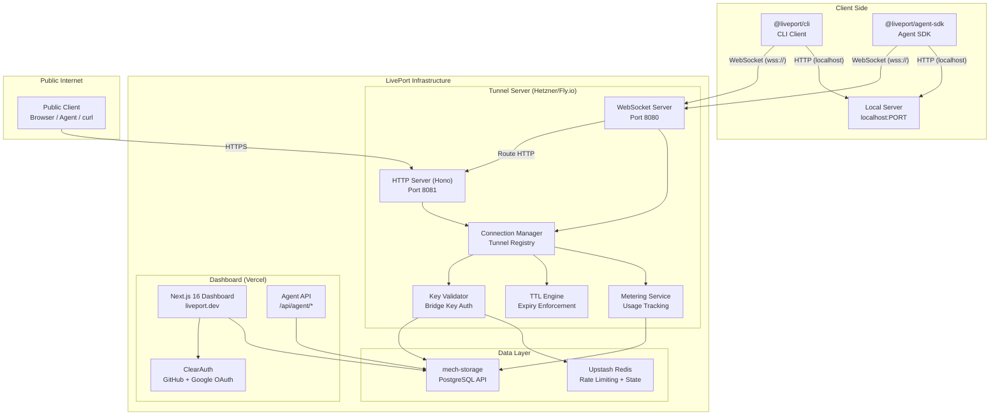
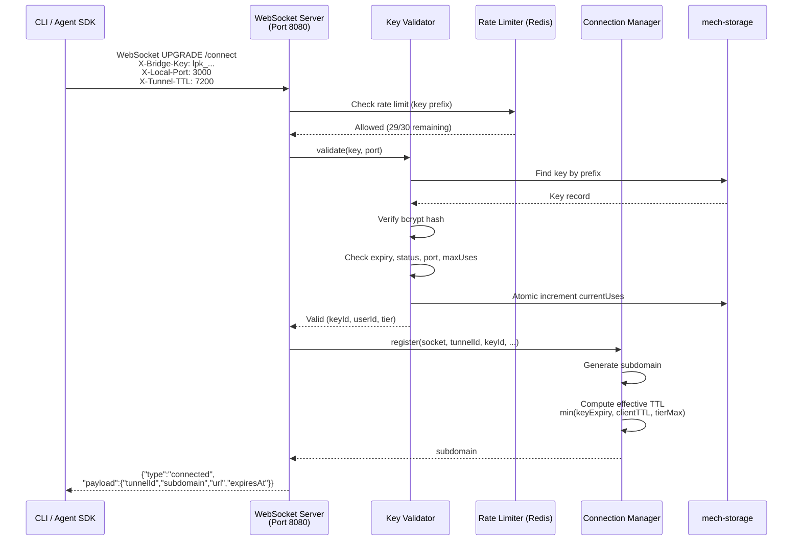
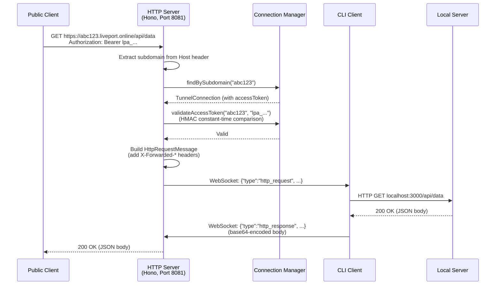
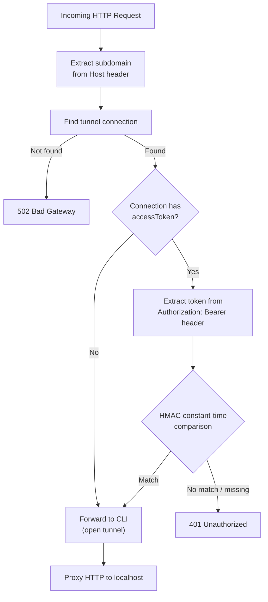

<!-- Generated: 2026-03-22 from docs-generator.json — do not edit manually -->
# LivePort Architecture

## Overview

LivePort is a secure localhost tunneling service designed for AI agents. It exposes local development servers to the internet through authenticated WebSocket tunnels with HTTP proxying.

## Component Diagram

## Data Flow: Tunnel Connection

## Data Flow: HTTP Proxy with Access Token

## Access Token Auth Flow

## Dual-Server Architecture

The tunnel server runs two servers to prevent middleware interference with WebSocket connections:

| Server | Port | Responsibility |
|--------|------|----------------|
| WebSocket Server | 8080 | WebSocket upgrades (`/connect` for CLI, other paths for proxied WebSockets). Proxies non-WebSocket HTTP to port 8081. |
| HTTP Server (Hono) | 8081 | HTTP request proxying, health checks, API endpoints, TLS certificate validation. |

**Why two servers?** Hono middleware (and Node.js HTTP frameworks in general) can interfere with WebSocket upgrade requests by writing headers or response bodies before the upgrade completes, causing "RSV1 must be clear" errors. The dedicated WebSocket server handles upgrades directly, bypassing all middleware.

## Security Architecture

### Bridge Key Validation
- Keys use the `lpk_` prefix format
- Stored as bcrypt hashes (with legacy SHA-256 fallback)
- Lookup by key prefix, then hash verification
- Rate limited: 30 validations/minute per key prefix (Redis sliding window)

### Atomic maxUses Enforcement
- Uses conditional SQL: `UPDATE ... SET currentUses = currentUses + 1 WHERE currentUses < maxUses`
- Returns null if at limit, preventing race conditions
- Usage decremented on disconnect

### Tunnel Expiry
- Expiry checker runs every 30 seconds
- Closes expired tunnels with `KEY_EXPIRED` error message and WebSocket close code 4002
- Effective expiry = `min(keyExpiresAt, now + clientTTL, now + tierMaxTTL)`

### Access Token Security
- Tokens prefixed with `lpa_` (32 random characters via nanoid)
- HMAC-based constant-time comparison prevents timing attacks
- Only generated for `liveport share` tunnels (regular `connect` tunnels stay open)

### Dev Key Bypass
- Only active when **both** `NODE_ENV=development` AND `ALLOW_DEV_KEYS=true`
- Returns a temporary free-tier key with 24h expiry
- Never available in production

### Request Security
- Hop-by-hop header stripping (Connection, Transfer-Encoding, etc.)
- 10MB max request body size
- Path sanitization (prevents path traversal)
- X-Forwarded-* headers added for proper origin tracking

## Database Schema

Tables stored via mech-storage (PostgreSQL API):

| Table | Purpose |
|-------|---------|
| `user` | User accounts (id, email, name, tier) |
| `session` | Auth sessions |
| `account` | OAuth provider accounts |
| `verification` | Email verification tokens |
| `bridge_keys` | Bridge key records (hash, prefix, expiry, maxUses, status) |
| `tunnels` | Tunnel connection records (metrics, timestamps) |

## Environment Variables

### Tunnel Server
| Variable | Description |
|----------|-------------|
| `PORT` | WebSocket server port (default: 8080) |
| `BASE_DOMAIN` | Base domain for tunnel subdomains (default: liveport.online) |
| `MECH_APPS_APP_ID` | mech-storage application ID |
| `MECH_APPS_API_KEY` | mech-storage API key |
| `MECH_APPS_URL` | mech-storage base URL |
| `REDIS_URL` | Redis connection string (for rate limiting) |
| `INTERNAL_API_SECRET` | Secret for internal API endpoints |
| `ALLOW_DEV_KEYS` | Enable dev key bypass (requires NODE_ENV=development) |
| `METERING_ENABLED` | Enable/disable usage metering |
| `PROXY_GATEWAY_ENABLED` | Enable HTTPS CONNECT proxy |
| `PROXY_TOKEN_SECRET` | Secret for proxy token signing |
| `PROXY_ALLOWED_HOSTS` | Allowlist for proxy gateway (required if proxy enabled) |

### Dashboard
| Variable | Description |
|----------|-------------|
| `MECH_APPS_APP_ID` | mech-storage application ID |
| `MECH_APPS_API_KEY` | mech-storage API key |
| `REDIS_URL` | Redis connection string |
| `AUTH_SECRET` | ClearAuth secret (32+ characters) |

## Deployment

- **Dashboard**: Deployed on Vercel (Next.js 16)
- **Tunnel Server**: Deployed on Hetzner (with Fly.io as alternative)
- **TLS**: Caddy reverse proxy with on-demand TLS for `*.liveport.online`
- **DNS**: Wildcard CNAME for `*.liveport.online` pointing to tunnel server
