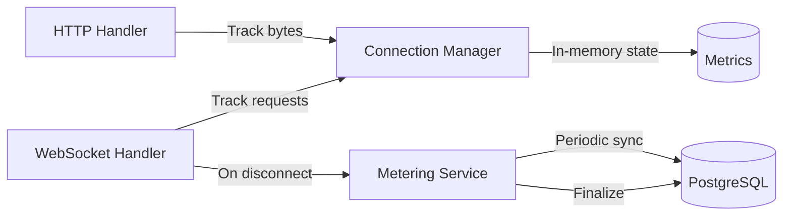

# Metering Architecture

## Overview

LivePort implements usage-based metering to support the pricing model ($0.000005/second + $0.05/GB). The metering system tracks three key metrics:

1. **Tunnel Duration**: Time (in seconds) each tunnel is open
2. **Bytes Transferred**: Total bytes (request + response bodies) transferred
3. **Request Count**: Number of HTTP requests (for analytics, not billing)

## Architecture

### Components



### Flow

1. **Request Tracking**:
   - HTTP handler receives request from user/agent
   - Measures request body size
   - Forwards to CLI client via WebSocket
   - Receives response from CLI client
   - Measures response body size
   - Increments `requestCount` and adds `bytesTransferred` to in-memory connection state

2. **Periodic Sync**:
   - Metering service runs every 60 seconds
   - Reads all active tunnel metrics from `ConnectionManager`
   - Updates or inserts records in `tunnels` table
   - Logs sync status

3. **Finalization**:
   - When tunnel disconnects, WebSocket handler calls `finalizeTunnelMetrics()`
   - Final metrics written to database with `disconnected_at` timestamp
   - Connection removed from memory

## Database Schema

The `tunnels` table stores metering data:

```sql
CREATE TABLE tunnels (
  id TEXT PRIMARY KEY,
  user_id TEXT NOT NULL,
  bridge_key_id TEXT REFERENCES bridge_keys(id),
  subdomain TEXT UNIQUE NOT NULL,
  local_port INTEGER NOT NULL,
  public_url TEXT NOT NULL,
  region TEXT DEFAULT 'us-east',
  connected_at TIMESTAMP DEFAULT NOW(),     -- Metered (start time)
  disconnected_at TIMESTAMP,                -- Metered (end time)
  request_count INTEGER DEFAULT 0,          -- Analytics only
  bytes_transferred BIGINT DEFAULT 0,       -- Metered
  updated_at TIMESTAMP DEFAULT NOW()
);
```

**Billing Calculation**:
```sql
-- Calculate tunnel duration in seconds
SELECT 
  SUM(EXTRACT(EPOCH FROM (COALESCE(disconnected_at, NOW()) - connected_at))) as total_seconds,
  SUM(bytes_transferred) as total_bytes
FROM tunnels
WHERE user_id = $1
  AND connected_at >= $2
  AND connected_at < $3;
```

## Implementation Details

### In-Memory Tracking

`TunnelConnection` interface (in `types.ts`):

```typescript
export interface TunnelConnection {
  id: string;
  subdomain: string;
  keyId: string;
  userId: string;
  localPort: number;
  socket: WebSocket;
  state: ConnectionState;
  createdAt: Date;
  lastHeartbeat: Date;
  requestCount: number;        // Incremented per request
  bytesTransferred: number;    // Accumulated per request
  expiresAt: Date;
}
```

### HTTP Handler (`http-handler.ts`)

```typescript
// Measure request body
let requestBodySize = 0;
if (["POST", "PUT", "PATCH", "DELETE"].includes(method)) {
  const bodyBytes = await c.req.arrayBuffer();
  requestBodySize = bodyBytes.byteLength;
}

// ... forward to CLI client ...

// Measure response body
let responseBodySize = 0;
if (response.body) {
  responseBody = Buffer.from(response.body, "base64");
  responseBodySize = responseBody.byteLength;
}

// Track total bytes
const totalBytes = requestBodySize + responseBodySize;
connectionManager.addBytesTransferred(subdomain, totalBytes);
```

### Metering Service (`metering.ts`)

**Periodic Sync**:
- Runs every 30 seconds (configurable via `METERING_SYNC_INTERVAL_MS`)
- Updates all active tunnels in database
- Creates tunnel records if they don't exist (for new connections)

**Finalization**:
- Called when tunnel disconnects
- Sets `disconnected_at` timestamp
- Ensures final metrics are persisted

**Configuration**:
```bash
# Disable metering (for testing)
METERING_ENABLED=false

# Change sync interval (default: 30000ms)
METERING_SYNC_INTERVAL_MS=30000
```

## Billing Calculation

### Monthly Usage Calculation

```typescript
// Query all tunnels for a user in a billing period
const tunnels = await db.query(`
  SELECT 
    SUM(EXTRACT(EPOCH FROM (COALESCE(disconnected_at, NOW()) - connected_at))) as total_seconds,
    SUM(bytes_transferred) as total_bytes
  FROM tunnels
  WHERE user_id = $1
    AND connected_at >= $2
    AND connected_at < $3
`, [userId, startOfMonth, endOfMonth]);

// Calculate cost
const tunnelSeconds = tunnels.total_seconds;
const tunnelCost = tunnelSeconds * 0.000005; // $0.000005 per second

const bandwidthGB = tunnels.total_bytes / (1024 * 1024 * 1024);
const bandwidthCost = bandwidthGB * 0.05;

const totalCost = tunnelCost + bandwidthCost;
```

### Example Costs

| Tunnel Duration | Bandwidth | Calculation | Total |
|-----------------|-----------|-------------|-------|
| 1 hour (3,600s) | 1 GB | (3600 × $0.000005) + $0.05 | **$0.07** |
| 8 hours (28,800s) | 5 GB | (28,800 × $0.000005) + $0.25 | **$0.39** |
| 24/7 month (2.6M s) | 25 GB | (2,592,000 × $0.000005) + $1.25 | **$14.21** |

### Stripe Integration (Phase 2)

```typescript
// Report usage to Stripe
await stripe.subscriptionItems.createUsageRecord(
  subscriptionItemId,
  {
    quantity: Math.round(bandwidthGB * 100), // Report in 0.01 GB units
    timestamp: Math.floor(Date.now() / 1000),
    action: 'increment',
  }
);
```

## Performance Considerations

### Why Periodic Sync?

- **Reduces DB load**: Writing to DB on every request would be expensive
- **Atomic updates**: Batch updates are more efficient than individual writes
- **Resilience**: In-memory state survives brief DB outages

### Memory Overhead

- Each `TunnelConnection` adds ~200 bytes to memory
- 1000 concurrent tunnels = ~200 KB (negligible)

### Database Load

- Sync every 60 seconds with 1000 tunnels = 1000 UPDATEs/minute
- PostgreSQL can easily handle this load
- Can increase interval if needed (e.g., 5 minutes for very high scale)

## Monitoring

### Key Metrics to Track

1. **Metering Lag**: Time between last sync and current time
2. **Sync Failures**: Number of failed DB writes
3. **Unfinalized Tunnels**: Tunnels with `disconnected_at = NULL` older than 1 hour

### Alerts

```yaml
# Example Prometheus alert
- alert: MeteringSyncFailing
  expr: metering_sync_errors_total > 5
  for: 5m
  annotations:
    summary: "Metering sync failing repeatedly"

- alert: UnfinalizedTunnels
  expr: tunnels_unfinalized_count > 100
  for: 10m
  annotations:
    summary: "Too many tunnels not finalized"
```

## Testing

### Local Testing

```bash
# Start tunnel server with metering enabled
cd apps/tunnel-server
METERING_ENABLED=true npm run dev

# Connect CLI client
cd packages/cli
npm run dev -- connect 3000 --key lpk_test123

# Make requests and watch logs
curl https://xyz123.liveport.dev

# Check database
psql $DATABASE_URL -c "SELECT subdomain, request_count, bytes_transferred FROM tunnels;"
```

### Unit Tests

```typescript
// Test metering service
describe('Metering Service', () => {
  it('should sync metrics to database', async () => {
    // Create mock connection
    const conn = createMockConnection();
    connectionManager.register(conn);

    // Simulate requests
    connectionManager.incrementRequestCount(conn.subdomain);
    connectionManager.addBytesTransferred(conn.subdomain, 1024);

    // Sync
    await syncMetrics();

    // Verify DB
    const result = await db.query('SELECT * FROM tunnels WHERE id = $1', [conn.id]);
    expect(result.rows[0].request_count).toBe(1);
    expect(result.rows[0].bytes_transferred).toBe(1024);
  });
});
```

## Future Enhancements

1. **Real-time Dashboards**: Stream metrics to Redis for live dashboard updates
2. **Request Logging**: Store detailed request logs (headers, paths) for debugging
3. **Usage Alerts**: Notify users when approaching billing thresholds
4. **Cost Estimation**: Show estimated monthly cost in CLI/dashboard
5. **Historical Analytics**: Aggregate metrics for long-term trend analysis

